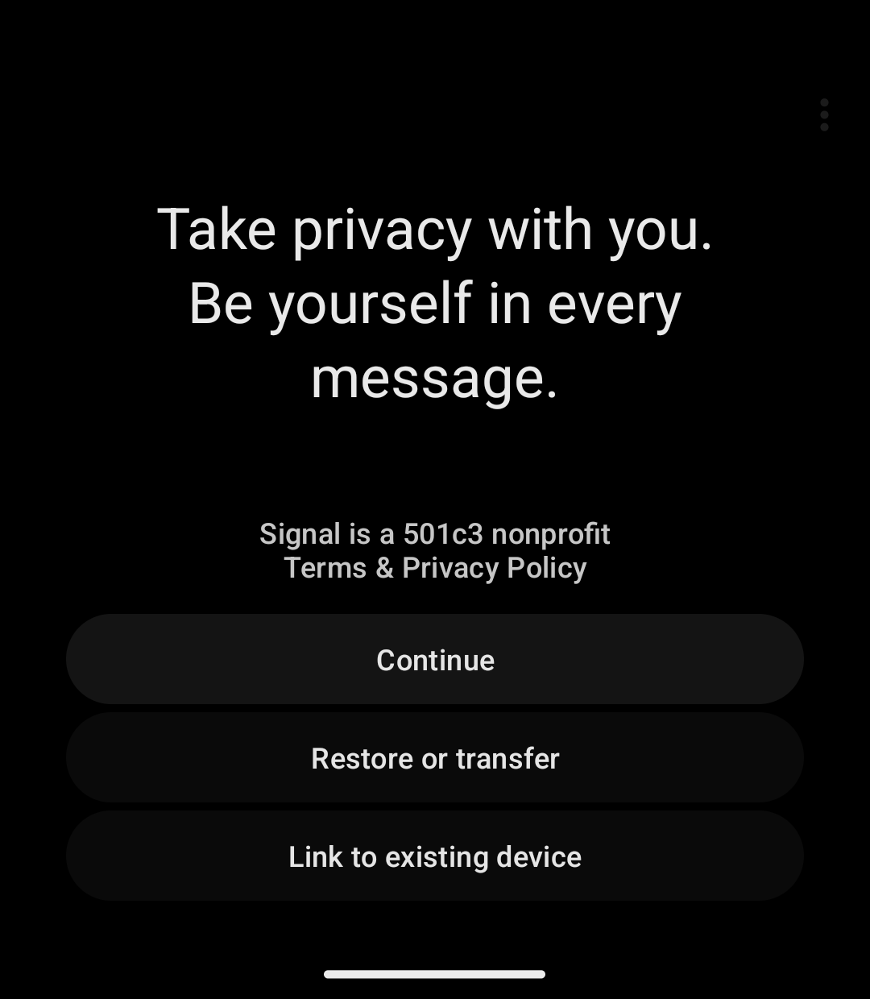
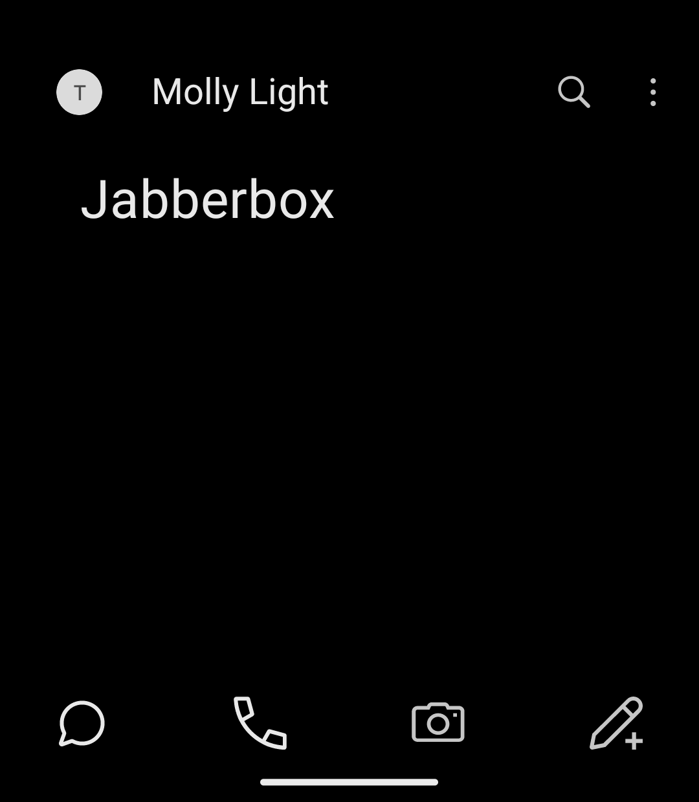
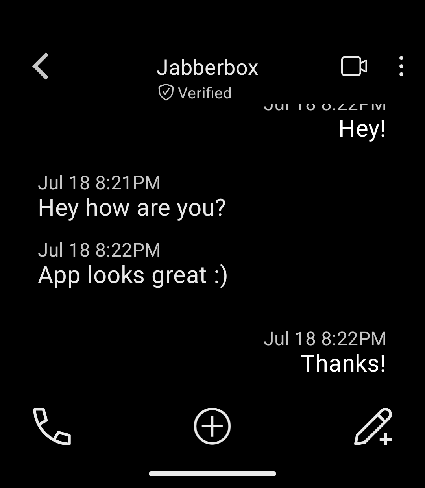
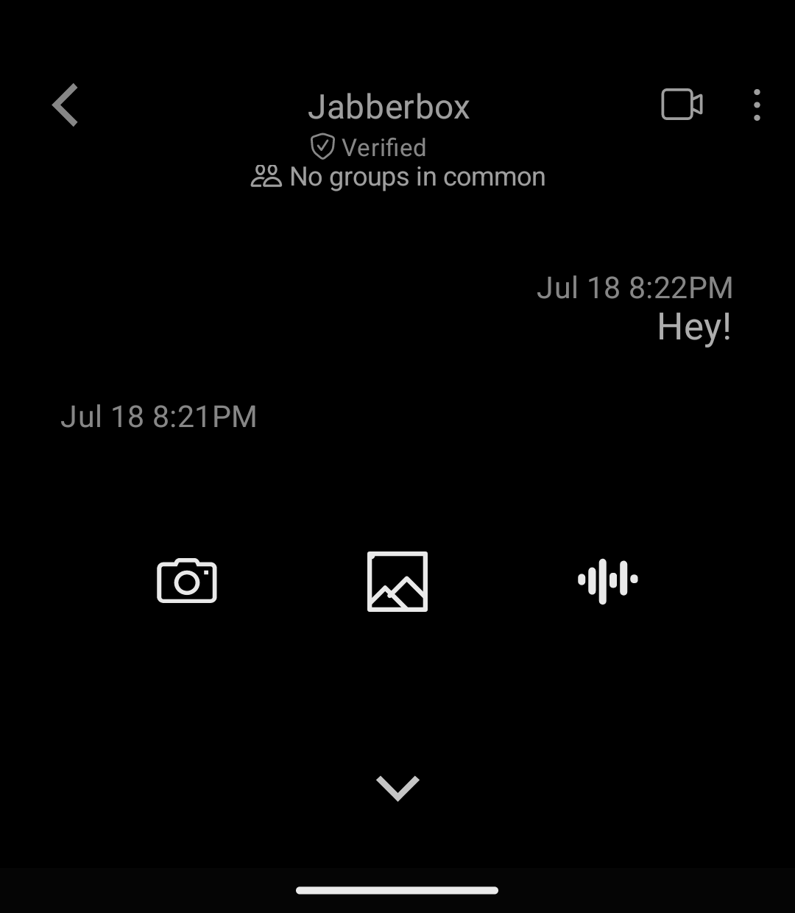
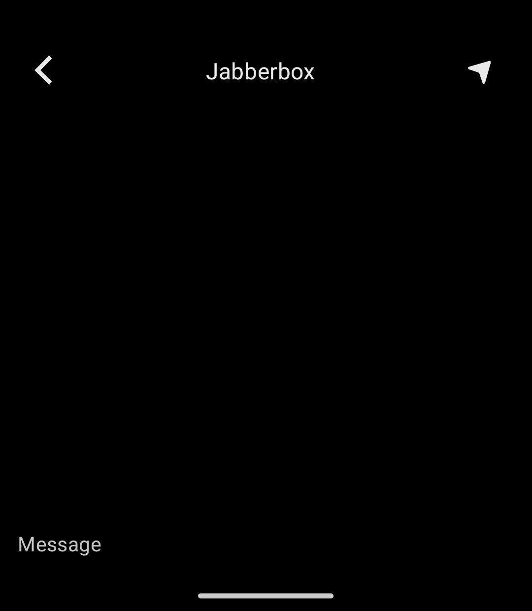

# Molly Light

A minimal reskin of Molly, inspired by the [Light Phone III](https://www.thelightphone.com/).

> **This is an unofficial personal fork of [Molly](https://github.com/mollyim/mollyim-android)**,
> which is itself a hardened fork of [Signal](https://github.com/signalapp/Signal-Android).
> It's not affiliated with, endorsed by, or sponsored by the Molly project,
> Signal Messenger, LLC, or the Signal Foundation. It connects to Signal's
> servers the same way Molly and Signal do, so it works with your existing
> Signal contacts and account. For the official, actively-maintained app, see
> upstream: [mollyim/mollyim-android](https://github.com/mollyim/mollyim-android).

## Why

Signal's UI is a lot of screen. A text box that's always there, a row of
icons, everything visible all the time. The Light Phone does the opposite:
show what you need, when you need it, and stay out of the way otherwise.

This fork rebuilds the conversation screen around that. No always-on text
box. Composing a message is its own full-screen action, not a row sitting
at the bottom of every chat.

## Screenshots

<table>
<tr>
<td align="center" width="33%">
 
Welcome screen
</td>
<td align="center" width="33%">
 
Chat list
</td>
<td align="center" width="33%">
 
Resting state: phone, plus, pencil
</td>
</tr>
<tr>
<td align="center" width="33%">
 
Plus: camera, gallery, audio
</td>
<td align="center" width="33%">
 
Pencil: full-screen compose
</td>
<td align="center" width="33%"></td>
</tr>
</table>

## What's different from Molly

- No persistent text box. A conversation at rest just shows three icons:
  call, add attachment, compose.
- Tapping the pencil replaces the conversation with a full-screen compose
  view. Back arrow, contact name, send arrow, and a bare cursor. No visible
  input box.
- Tapping the plus icon opens a small sheet with three options: camera,
  gallery, audio. Not Signal's full attachment keyboard.
- New launcher icon and splash screen, a simplified Help page, and a few of
  Molly's own settings (the in-app update checker, the donation link)
  removed or left alone depending on whether they still made sense here.
  Full details in [LEGAL.md](LEGAL.md).
- Everything else works the same as upstream Molly: encryption,
  registration, backups, linked devices, all of it.

## Download

Grab the APK from this repo's [Releases](https://github.com/jabberbox/molly-light/releases) page.

It's signed with a key only I control, not related to Molly's or Signal's
official keys. It won't install over an existing Molly or Signal app.

## Building from source

See [BUILDING.md](BUILDING.md). Same source tree as upstream Molly, with the
reskin on top.

## Compatibility with Signal

Molly Light connects to Signal's servers, so it works with your existing
account and contacts. If you want to keep Signal or Molly running on the
same device with the same number, register Molly Light as a linked device
instead of a primary one. Otherwise whichever app you registered most
recently stays active and the other goes offline.

## Backups

Backups are compatible both ways. Restore a Molly or Signal backup in Molly
Light, or the reverse, just by picking the backup folder or file during
setup.

## License

AGPL-3.0-only. See [LICENSE](LICENSE) for the full text and
[LEGAL.md](LEGAL.md) for copyright and trademark details.

## Acknowledgements

This is a personal reskin built entirely on the work of the
[Molly](https://github.com/mollyim/mollyim-android) and
[Signal](https://github.com/signalapp/Signal-Android) projects. All the
actual messaging, encryption, and hardening work is theirs. Thanks to both
sets of contributors.
